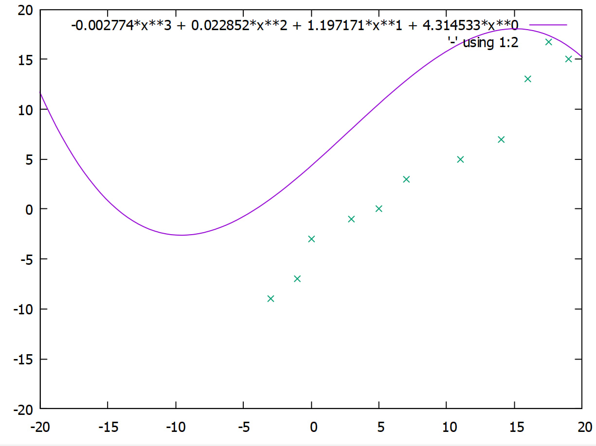

# Least Square Approximation
C++ program to compose a least square approximation for a given data set. Itvgenerates an image with GNUPlot.


List of points that were tested:
```
-9 -7 -3 -1 0 3 5 7 13 15
-3 -1 0 3 5 7 11 14 16 19
``` 

Obtained graph generated by GNUPlot:



